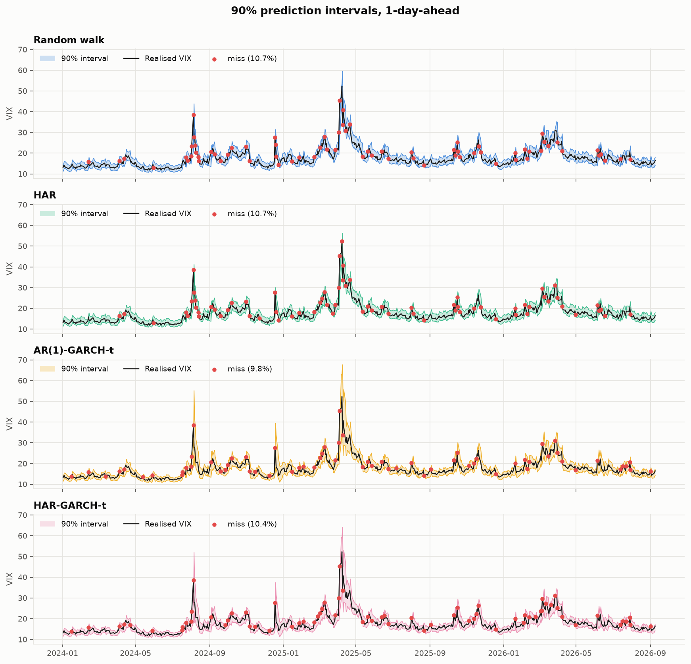
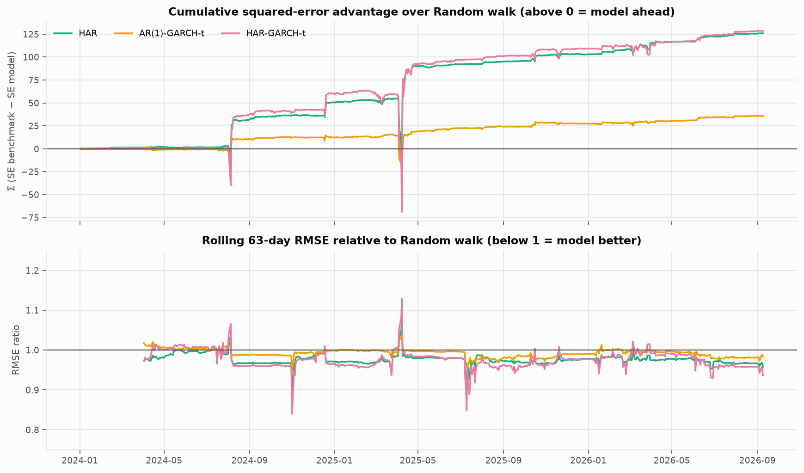
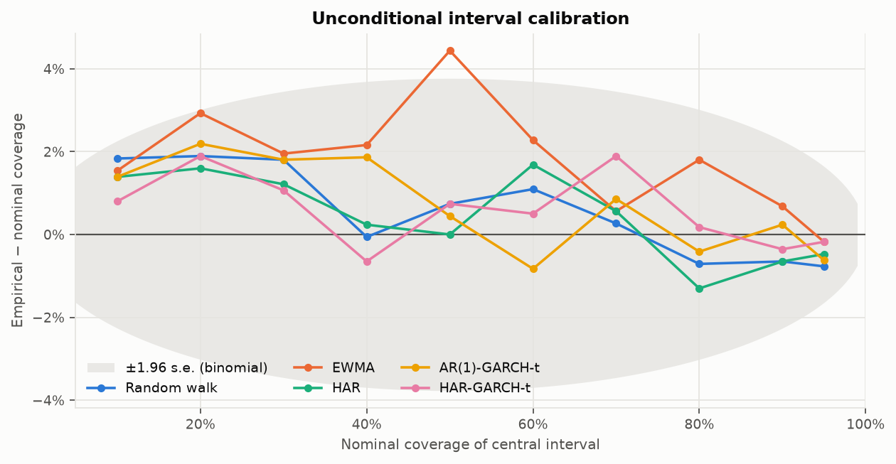

# Implied-volatility forecasting: walk-forward VIX models with rigorous evaluation

[](https://github.com/SomeGuy966/implied-volatility-forecasting/actions/workflows/ci.yml)


`vixcast` forecasts the CBOE VIX (the market's 30-day implied volatility for the S&P 500) one and five trading days ahead, as a **full predictive distribution**, and asks a question that is easy to get wrong: *does any model beat a random walk, and if so, where?*

Five models are refitted at every one of 676 forecast origins (Jan 2024 – Sep 2026) with a strict no-look-ahead walk-forward engine, and scored on point accuracy, interval calibration and proper scoring rules — each with a formal test against the random-walk benchmark.

## Headline findings

1. **Point forecasts of the VIX level are a near-draw with the random walk at one day.** The best model (HAR-GARCH-t) improves RMSE by 2.5%; under squared loss no model is significantly better, under absolute loss all three serious models are (Diebold–Mariano p < 0.05). At five days, mean reversion starts to pay: HAR cuts RMSE by 8.5% (DM p < 0.05).
2. **The value of GARCH is in the *conditional* distribution, not the mean.** Random-walk and HAR intervals have the right coverage *on average* (Kupiec p ≈ 0.4–0.6) yet fail the Christoffersen independence test (p ≤ 0.05 at every level): their misses cluster in volatility spikes. Both GARCH-t models pass (p ≥ 0.6) and earn 6–10% lower interval scores.
3. **All of this depends on a clean backtest.** The original version of this project scored the random walk on roughly ten forward-filled holidays a year (a free zero-error day each) and built Student-t bands 25% too wide by mixing up raw and standardised t-quantiles. Both are documented below; both moved the conclusions.

<p align="center"></p>

*One-day-ahead 90% intervals. The random walk and HAR bands are empirical residual quantiles and cannot react to the April 2025 spike; the GARCH bands widen immediately. Red dots are misses.*

<p align="center"></p>

*Where the point-forecast edge comes from: the models lose to the random walk on the day of a spike and win it back — with interest — on the mean reversion that follows.*

## Results

Test window: 2024-01-02 → 2026-09-09, 676 trading-day targets, expanding estimation window from 2010 refitted at every origin. DM statistics are against the random walk; positive = model better; `*`/`**`/`***` = p < 0.10 / 0.05 / 0.01. Full tables for every level and horizon are in [`results/summary.md`](results/summary.md) and [`results_h5/summary.md`](results_h5/summary.md).

### One-day-ahead point forecasts

| Model | RMSE | MAE | RMSE / RW | DM (sq. loss) | DM (abs. loss) |
| :-- | --: | --: | --: | --: | --: |
| Random walk | 1.949 | 1.096 | 1.000 | – | – |
| EWMA | 3.502 | 2.161 | 1.797 | -4.34*** | -12.66*** |
| HAR | 1.900 | 1.073 | 0.975 | +0.98 | +2.09** |
| AR(1)-GARCH-t | 1.935 | 1.080 | 0.993 | +0.75 | +2.68*** |
| HAR-GARCH-t | 1.899 | 1.056 | 0.975 | +0.69 | +2.40** |

### One-day-ahead 90% prediction intervals

| Model | Coverage | Avg width | Interval score | IS / RW | Kupiec p | Christoffersen p | DM (IS) |
| :-- | --: | --: | --: | --: | --: | --: | --: |
| Random walk | 89.3% | 4.18 | 7.87 | 1.000 | 0.58 | 0.00 | – |
| EWMA | 90.7% | 8.87 | 13.92 | 1.770 | 0.55 | 0.00 | -5.56*** |
| HAR | 89.3% | 4.12 | 7.65 | 0.973 | 0.58 | 0.05 | +1.64 |
| AR(1)-GARCH-t | 90.2% | 4.42 | 7.32 | 0.931 | 0.84 | 0.79 | +1.63 |
| HAR-GARCH-t | 89.6% | 4.28 | 7.26 | 0.922 | 0.76 | 0.83 | +1.48 |

Reading this table: every model except EWMA is unconditionally calibrated (Kupiec), but only the GARCH models produce misses that arrive independently (Christoffersen). The interval score — a proper scoring rule that rewards narrow bands and penalises misses by distance — is 7–8% better for GARCH, and the improvement is significant at the 80% level (see the full tables).

### Whole predictive distribution (average pinball loss over 21 quantiles, h = 1)

| Model | Avg pinball loss | vs RW | DM |
| :-- | --: | --: | --: |
| Random walk | 0.4022 | 1.000 | – |
| HAR | 0.3923 | 0.975 | +2.20** |
| AR(1)-GARCH-t | 0.3912 | 0.973 | +2.50** |
| HAR-GARCH-t | 0.3829 | 0.952 | +2.51** |

### Five-day-ahead point forecasts

| Model | RMSE | MAE | RMSE / RW | DM (sq. loss) | DM (abs. loss) |
| :-- | --: | --: | --: | --: | --: |
| Random walk | 3.747 | 2.244 | 1.000 | – | – |
| HAR | 3.430 | 2.059 | 0.915 | +2.15** | +3.36*** |
| AR(1)-GARCH-t | 3.710 | 2.227 | 0.990 | +0.88 | +0.70 |
| HAR-GARCH-t | 3.452 | 2.035 | 0.921 | +1.58 | +2.59*** |

At five days the picture inverts: the AR(1)-GARCH on *log returns* treats log-VIX as integrated and cannot exploit mean reversion, so it barely beats the random walk, while the HAR family — which models the *level* — is 8% better. HAR-GARCH-t's simulated 5-day intervals are slightly under-covered at 90% (86.5%, Kupiec p < 0.01); an honest weakness left on the table rather than tuned away.

<p align="center"></p>

*Empirical minus nominal coverage for central intervals from 10% to 95%. Every model sits inside the ±1.96 s.e. band a perfectly calibrated forecaster would occupy with 676 observations — unconditional calibration is not where these models differ.*

## What is in the box

### Models

All models operate on log VIX so that level forecasts are positive by construction, and every model returns a full set of quantiles, so interval metrics compare like with like.

| Key | Model | Mean equation | Distribution of errors |
| :-- | :-- | :-- | :-- |
| `rw` | Random walk | x̂<sub>t+h</sub> = x<sub>t</sub> | Empirical quantiles of past h-step changes |
| `ewma` | EWMA (α = 0.05) | Exponentially weighted mean | Empirical residual quantiles |
| `har` | HAR (Corsi 2009) | OLS on x<sub>t</sub>, mean(x<sub>t−4..t</sub>), mean(x<sub>t−21..t</sub>); direct h-step regression | Empirical residual quantiles |
| `ar_garch` | AR(1)-GARCH(1,1)-t | AR(1) on Δx (log returns) | GARCH(1,1), standardised Student-t; simulated for h > 1 |
| `har_garch` | HAR-GARCH(1,1)-t | HAR on x (log level) | GARCH(1,1), standardised Student-t; simulated for h > 1 |

The two GARCH models are deliberately paired: one models the *changes* (integrated log-VIX), one models the *level* (mean-reverting log-VIX) with the same variance dynamics, so the effect of the mean specification is isolated.

### Evaluation

| Question | Statistic | Reference |
| :-- | :-- | :-- |
| Is the point forecast better than the random walk? | RMSE, MAE, Diebold–Mariano test with Bartlett HAC variance (h−1 lags) and Harvey–Leybourne–Newbold small-sample correction | Diebold & Mariano (1995); Harvey et al. (1997) |
| Is the interval the right width on average? | Empirical coverage, Kupiec unconditional-coverage LR test | Kupiec (1995) |
| Do misses cluster? | Christoffersen independence and conditional-coverage LR tests | Christoffersen (1998) |
| Are the intervals *good* (sharp **and** calibrated)? | Winkler / interval score, with a DM test on the score series | Gneiting & Raftery (2007) |
| Is the whole distribution better? | Average pinball loss over a 21-point quantile grid (a discretised CRPS), with a DM test | Gneiting & Raftery (2007) |
| Where does the edge come from? | Cumulative squared-error difference and rolling RMSE ratio vs. the benchmark | — |

### Walk-forward protocol

For every target date *d* in the test window and every model, the model is estimated on log-VIX up to the origin *d − h* **trading days** (positional, so weekends and holidays never leak in), and asked for the distribution of log-VIX at *d*. Every model is refitted at every origin — 3,380 fits per horizon — which takes about 20 seconds on a laptop thanks to `joblib`. The window is expanding by default; `--window N` switches to a rolling window.

The property that makes all of this meaningful — that no forecast depends on data after its origin — is tested directly: [`tests/test_backtest.py::test_no_look_ahead`](tests/test_backtest.py) corrupts every observation after the origin and asserts the forecast is bit-identical, for every model.

## Quickstart

```bash
git clone https://github.com/SomeGuy966/implied-volatility-forecasting
cd implied-volatility-forecasting
make install          # creates .venv and installs vixcast with dev tools
make run              # full 1-day-ahead backtest from the cached data -> results/, figures/
make run-h5           # 5-day-ahead variant -> results_h5/, figures_h5/
make check            # ruff + mypy --strict + pytest
```

Or drive it directly:

```bash
vixcast --help
vixcast --horizon 5 --window 1500 --models rw,har,har_garch --levels 0.9,0.99
vixcast --refresh-data           # re-download from Yahoo Finance and overwrite data/vix.csv
```

The VIX history is committed in [`data/vix.csv`](data/vix.csv) so that every run — including CI — is reproducible and offline. Runs are deterministic: the same inputs produce byte-identical `results/`.

```python
from vixcast import Config, run

out = run(Config(horizon=1, models=("rw", "har", "har_garch"), make_plots=False))
print(out.point)          # tidy DataFrame of point-forecast metrics
print(out.intervals)      # one row per (model, level)
out.forecasts             # long-format frame: every forecast, every quantile, every date
```

## Repository layout

```
src/vixcast/
├── config.py        frozen Config dataclass — one object fully describes a run
├── data.py          download / cache / validate the close series (no calendar reindexing)
├── backtest.py      walk-forward engine: positional origins, joblib-parallel fits
├── evaluation.py    DM, Kupiec, Christoffersen, interval score, pinball, calibration
├── plotting.py      the four figures (matplotlib, headless)
├── report.py        CSV writers and the Markdown summary
├── pipeline.py      run(cfg) -> RunOutputs
├── cli.py           argparse front-end (`vixcast`)
└── models/
    ├── base.py      Forecaster ABC + LogForecast dataclass
    ├── baselines.py RandomWalk, EWMA
    ├── har.py       HAR with an O(n) design-matrix builder
    └── garch.py     AR-/HAR-GARCH-t on `arch`, with the nested-likelihood guard
tests/               62 tests: models, engine (no-look-ahead, alignment), every statistic
data/vix.csv         cached VIX closes 2010-01-04 → 2026-09-09 (actual trading calendar)
results/, figures/   committed outputs of `make run` (h = 1); *_h5 for `make run-h5`
```

Adding a model is one class implementing `Forecaster.forecast(log_history, horizon, probs) -> LogForecast` and one line in the registry in `models/__init__.py`; the CLI, engine, tables and plots pick it up by key.

## Design decisions and pitfalls avoided

These are the things that changed the numbers, in decreasing order of embarrassment.

- **Keep the real trading calendar.** Reindexing to Monday–Friday and forward-filling holidays (a common "tidy-up") inserts nine or ten test days a year on which the random walk is scored as exactly right (4.5% of the original test set). `data.py` never reindexes, and a test asserts the loader does not manufacture repeated values.
- **`arch` distributions are standardised.** The package's Student-t has unit variance, so intervals are `μ + σ · t⁻¹<sub>std</sub>(p)`. Using SciPy's raw `t.ppf` inflates every band by √(ν/(ν−2)) — 25% at ν = 5 — which reads as "conservative, safe" in a coverage table and is actually a bug. `garch.py` asks the fitted distribution for its own quantiles.
- **A converged optimiser is not a good fit.** GARCH likelihoods have poor local optima and `arch` will report success from one of them; the first version of HAR-GARCH produced a mean forecast of 50 and a 90% band of [1.6, 1517] on 2025-07-15. The guard is exact rather than heuristic: the constant-variance model is nested in GARCH, so its likelihood is a floor the GARCH fit must clear. Each fit starts from the nested model's parameters, is rejected if it falls below that floor, retries from default starts, and finally falls back to the nested model with `converged=False` (2 of 676 origins at h = 1, reported in `metrics_point.csv`). No ad-hoc clipping of σ, ν or the forecast.
- **Test what matters.** Beyond the no-look-ahead test, the DM test's size is checked by Monte Carlo (≈5% rejections under the null), Kupiec is checked against its closed form, Christoffersen is checked to reject clustered misses with correct unconditional coverage, and the interval score and pinball loss are checked to be minimised at the true quantiles.
- **Paired comparisons only.** Every metric is computed on the intersection of dates all models forecast, so DM tests are paired and ratios are like-for-like.
- **Say what a test cannot say.** Christoffersen's independence null is invalid for overlapping multi-step targets; the h = 5 summary says so instead of printing p-values that look damning.
- **Median, not mean, on the level scale.** Forecasts are made in logs and exponentiated, which yields the conditional *median* of the level. That is the right target for MAE and the interval bounds, and slightly biased low for RMSE — an accepted trade for keeping all models on one footing.

## Limitations and natural extensions

- **Horizons.** h = 1 and h = 5 are reported; the CLI accepts any h, but VIX is a 30-day measure and the interesting term-structure questions (VIX vs. VIX futures, variance-risk premium) need futures data.
- **Exogenous information.** No realised-variance, SPX-return, or VIX-futures-basis regressors. The HAR-X structure in `arch` makes adding them a small change to `garch.py`.
- **Parameter uncertainty** is ignored in the intervals; a bootstrap over the estimation window would widen the GARCH bands slightly at long horizons (which is the direction of the 5-day under-coverage).
- **Model combination.** The models' edges are in different regimes (HAR after spikes, GARCH in the bands); a simple average or a regime-weighted combination is the obvious next experiment and the engine's long-format output makes it a few lines.
- **Economic evaluation.** Statistical accuracy is not P&L; the natural next step is a VIX-futures or variance-swap trading rule with transaction costs, evaluated on the same walk-forward split.

## References

- Bollerslev, T. (1986). Generalized autoregressive conditional heteroskedasticity. *Journal of Econometrics*, 31(3).
- Christoffersen, P. F. (1998). Evaluating interval forecasts. *International Economic Review*, 39(4).
- Corsi, F. (2009). A simple approximate long-memory model of realized volatility. *Journal of Financial Econometrics*, 7(2).
- Diebold, F. X. & Mariano, R. S. (1995). Comparing predictive accuracy. *Journal of Business & Economic Statistics*, 13(3).
- Gneiting, T. & Raftery, A. E. (2007). Strictly proper scoring rules, prediction, and estimation. *JASA*, 102(477).
- Harvey, D., Leybourne, S. & Newbold, P. (1997). Testing the equality of prediction mean squared errors. *International Journal of Forecasting*, 13(2).
- Kupiec, P. H. (1995). Techniques for verifying the accuracy of risk measurement models. *Journal of Derivatives*, 3(2).
- Sheppard, K. *arch* — ARCH models in Python. https://github.com/bashtage/arch

## License

MIT — see [LICENSE](LICENSE).
