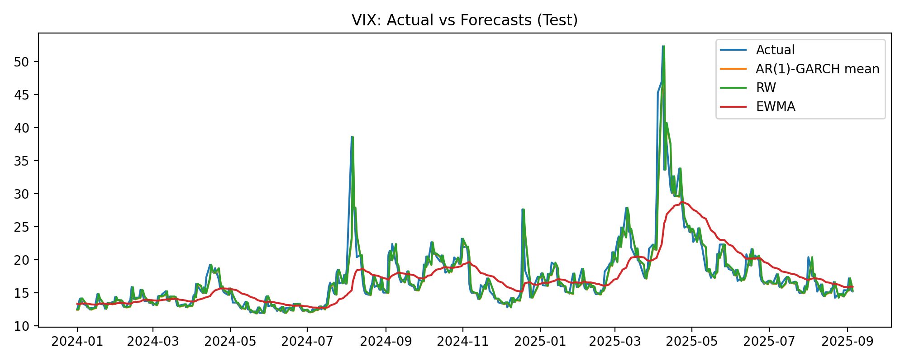
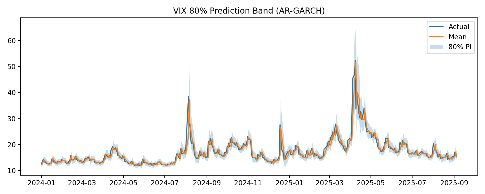
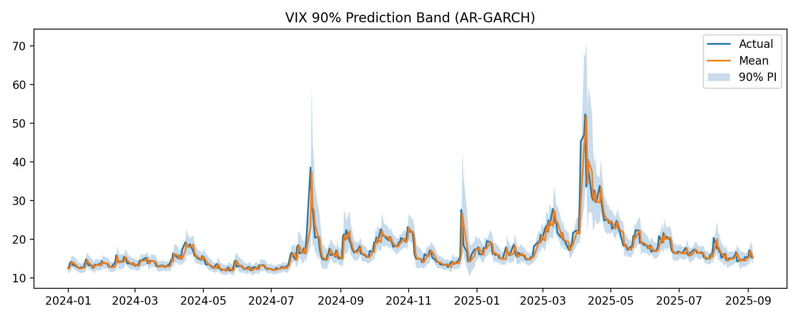
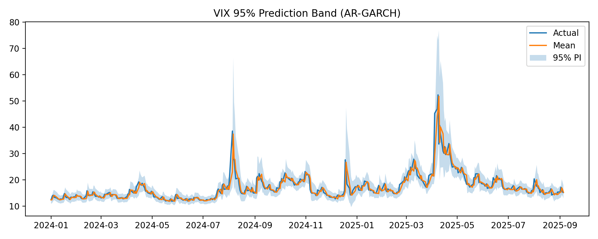

# Implied Volatility Forecasting on VIX with AR–GARCH

This project forecasts the VIX level and its uncertainty using a rolling AR(1)–GARCH(1,1) model estimated on log-returns, and compares it to simple time-series baselines. The goal is to understand how well such a model can anticipate the VIX (which itself is derived from S&P 500 options) and to assess not only point forecast accuracy but also the calibration and width of prediction intervals.

---

## Vocabulary

| Term | Meaning |
| --- | --- |
| **VIX** | CBOE Volatility Index, a model-free 30-day variance swap proxy implied from SPX option prices. Interpreted as an annualized % volatility. |
| **Implied volatility (IV)** | The market-implied standard deviation of future returns, backed out from option prices. VIX is a specific IV index for SPX. |
| **Log VIX** | Natural log of the VIX level. We model log-returns for stationarity and to keep predictions positive after exponentiation. |
| **Log-return (`dlog_vix`)** | First difference of log VIX: \(\Delta \log VIX_t = \log VIX_t - \log VIX_{t-1}\). |
| **AR(1)** | Autoregression with one lag in the conditional mean of log-returns. |
| **GARCH(1,1)** | Conditional variance model where today’s variance depends on yesterday’s squared shock and yesterday’s variance. |
| **Student-t innovations** | Heavy-tailed error distribution for residuals; more robust to VIX spikes than Gaussian. |
| **Prediction interval (PI)** | Interval intended to contain the future realized VIX with a given probability (e.g., 90%). |
| **Coverage** | Fraction of test observations that actually fall inside a nominal PI (e.g., should be ≈0.90 for a 90% PI if well-calibrated). |
| **Average width** | Mean distance between the lower and upper bound of a PI; narrower is better for the same coverage. |
| **Random Walk (RW)** | Baseline point forecast equal to yesterday’s VIX level. |
| **EWMA** | Exponentially Weighted Moving Average baseline of VIX levels, used as another simple forecaster. |
| **RMSE / MAE** | Root Mean Squared Error and Mean Absolute Error—lower is better. |
| **Train/Test split** | We fit up to 2023-12-31 and evaluate out-of-sample from 2024-01-01 onward. |

---

## What the code does

The pipeline downloads historical VIX levels, constructs both the log level and daily log-returns, and performs a clean train/test split. For each business day in the test period, it re-estimates an AR(1)–GARCH(1,1) with Student-t innovations on all data available up to the day before the forecast date. To stabilize optimization and improve numerical conditioning, the code temporarily rescales returns before fitting, then maps forecasts back to the original scale.

From each fitted model, it forms a one-step-ahead forecast for the next day’s log VIX mean and its conditional variance. Those quantities are then converted to a VIX-level point forecast by exponentiating the predicted log level. Prediction intervals are constructed by taking appropriate Student-t quantiles around the predicted log level, then exponentiating the bounds to obtain intervals on the VIX scale. In parallel, two baseline forecasters are produced: a Random Walk that simply uses yesterday’s level, and an EWMA smoother evaluated one day ahead.

All forecasts are joined on the test dates and written to CSV artifacts. The code computes point-forecast errors (RMSE and MAE) for each model and evaluates interval quality by reporting empirical coverage vs. nominal (80/90/95%) along with average widths. Finally, it renders figures: (1) an overlay of the actual VIX and all point forecasts, and (2) shaded prediction-band plots that show how realized VIX evolved relative to the model’s uncertainty bands.

---

## Results (current run)

### Point-forecast accuracy
| model       |   RMSE |   MAE |
|:------------|-------:|------:|
| garch_pred  | 2.1045 | 1.0573 |
| rw          | 2.1153 | 1.0676 |
| ewma        | 3.6609 | 2.1536 |

**Interpretation.** The AR–GARCH mean edges out the Random Walk by a small margin (≈0.01 in RMSE and MAE), while EWMA lags meaningfully. The closeness between AR–GARCH and RW is typical for volatility level forecasting: levels are persistent and hard to beat with purely time-series dynamics. Still, the GARCH-based mean achieves consistently lower error here, suggesting a modest benefit from modeling conditional mean/variance structure in log-returns.

### Prediction-interval calibration and sharpness
| band | coverage |
|:----:|:--------:|
| 80%  | 0.8682 |
| 90%  | 0.9250 |
| 95%  | 0.9545 |

| band | avg_width |
|:----:|----------:|
| 80%  | 3.9809 |
| 90%  | 5.2758 |
| 95%  | 6.5118 |

**Interpretation.** Coverage is slightly **above** nominal at all three levels (e.g., 90% PI covers ~92.5%). That means the intervals are a bit conservative—wider than strictly necessary for the realized variability—which is often preferable to under-coverage for risk management. Width grows sensibly with the band (≈4.0 → 5.28 → 6.51), and visually the bands expand around volatile episodes, reflecting a larger conditional variance.

---

## Figures

Below are the PNGs produced into `figures/` by the current run.

**1) Actual vs Forecasts (test period)**

*Reading the chart.* The black line is the realized VIX. The orange line is the AR–GARCH one-step-ahead mean forecast on the VIX level (derived from the log-scale model). Blue and green lines are the Random Walk and EWMA baselines. You’ll generally see the RW track the level closely, while AR–GARCH can slightly adjust for recent shocks through the log-return dynamics.

**2) 80% prediction band**

**3) 90% prediction band**

**4) 95% prediction band**

*Reading the band plots.* The shaded region shows the model’s uncertainty for the next-day VIX. When the realized series (black) exits the band, that’s a “miss.” Given the empirical coverages above, misses are infrequent and roughly align with expectations for each nominal level; the slight excess coverage indicates conservative bands.

---

## Project scope

Although we model the **VIX index** time series directly, remember that VIX itself is **computed from SPX option prices**; it’s an options-derived, forward-looking volatility metric. This project therefore sits at the intersection of options and time-series modeling: we’re not pricing individual options here, but we are forecasting an options-implied volatility index and its uncertainty.

---

## Produced artifacts

- `results/baseline_forecasts.csv` – RW and EWMA point forecasts and realized values for the test period.  
- `results/garch_forecasts.csv` – AR–GARCH point forecasts and 80/90/95% prediction intervals, with realized values.  
- `results/metrics_mean.csv` – RMSE/MAE table shown above.  
- `results/metrics_coverage.csv`, `results/metrics_width.csv` – Interval coverage and average width tables.  
- `figures/test_overlay_all.png`, `figures/band_80.png`, `figures/band_90.png`, `figures/band_95.png` – Charts embedded above.

---

*Last updated from a run that printed the metrics and saved the figures to `results/` and `figures/` respectively.*
